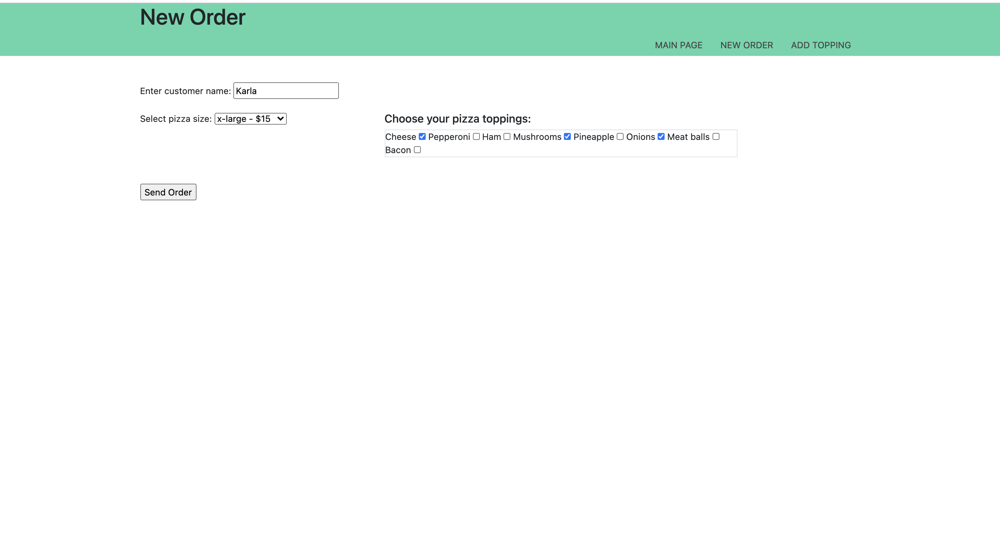

# Pizza MIA

## Pizza MIA

* [Installation](#installation)
* [Usage](#usage)
* [Contributing](#contributors)
* [Tests](#tests)
* [License](#badges)

## Usage
- An application that would make it easier to keep track of orders for employees in the middle of a busy shift.

## Installation
- To install the project follow the following instructions:
*The client will clone the repository onto their local device.

## GitHub Repository Link

- https://github.com/lmrujana/project_2

## Contributors
- Please find the contributors of this project below:
    - Jack Ceballos 
    - Luis Rujana 
    - Rich Wilkinson 
    - Jakub Marchel 
    - Joivre Charles

## Tests
- Here are illustrations of the page in action that were completed on this project before release:

    

    

    

    

## License Used in this project
- MIT

## Badges

## Questions
* Please direct Questions to the following
- https://github.com/lmrujana

